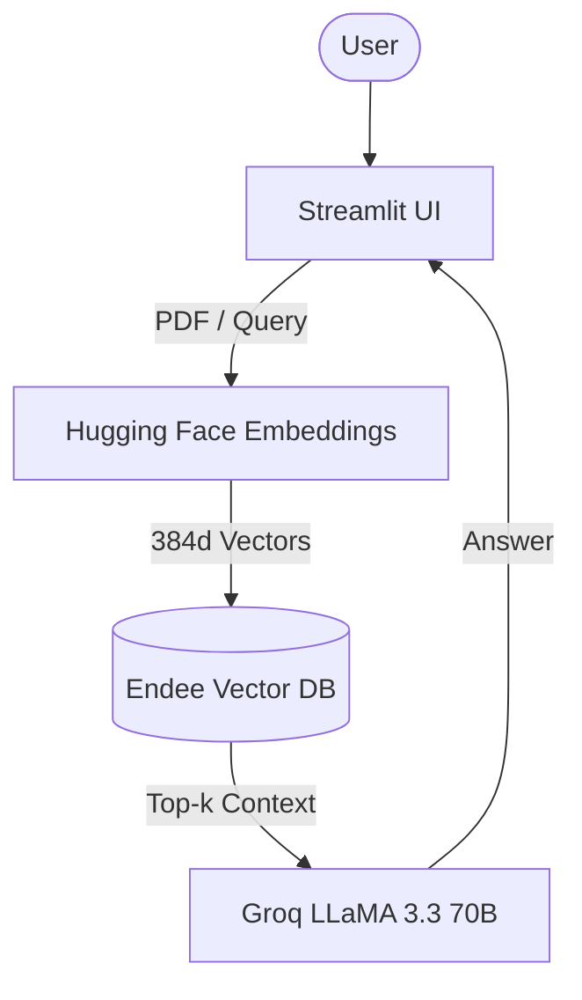

## ⚡ RAGee
A Retrieval-Augmented Generation (RAG) application that allows users to upload PDFs, index them into a local vector database (Endee), and query them using a large language model with semantic search.
This project uses:
- Endee for local vector storage
- Hugging Face embeddings (MiniLM)
- Groq-hosted LLaMA 3.3 (70B) for generation
- Streamlit for the UI
- Docker Compose for running Endee locally
___
### ✅ Why Endee?
Endee is chosen as the vector database for this project because it offers a rare combination of performance, flexibility, and simplicity, especially for local and self-hosted RAG applications.

While many vector databases focus on managed or cloud-first setups, Endee provides:
- High-performance ANN search using HNSW
- Explicit quantization control (INT8, INT16, FLOAT16, etc.) to balance speed, memory, and accuracy
- Native metadata and advanced filtering
- Hybrid search capabilities
- Persistent local storage via Docker volumes

Although some vector databases also support quantization, these features are often coupled with heavier infrastructure requirements or more complex configuration. Endee exposes quantization and other performance optimizations in a lightweight, developer-friendly manner, making it well suited for experimentation, local RAG workflows, and production-ready prototypes with minimal operational overhead.
___
### 🏗️ Project Structure
```text
rag-endee/
│
├── app.py                  # Streamlit RAG application
├── utils.py                # PDF processing + embedding utilities
├── docker-compose.yml      # Endee vector DB service
├── requirements.txt        # Python dependencies
├── .env                    # API keys (not committed)
└── endee_data/             # Persistent vector storage (Docker volume)
```
___
### 🧠 Architecture Overview

___
### ⚙️ Prerequisites
Make sure you have the following installed:
- Python 3.9+
- Docker & Docker Compose
- Hugging Face API key
- Groq API key
___
### 🔐 Environment Variables
Create a .env file in the project root:
- HF_API_KEY = your_huggingface_api_key
- GROQ_API_KEY = your_groq_api_key
___
### 📦 Installation
1️. Clone the Repository
- git clone https://github.com/your-username/rag-endee.git
- cd rag-endee

2️. Install Python Dependencies
- pip install -r requirements.txt

3️. Start Endee Vector Database
- docker-compose up -d
- This starts the Endee server at: http://localhost:8080
- Vectors are stored persistently in endee_data/.

4️. Run the Streamlit App
- streamlit run app.py
- The app will be available at: http://localhost:8501
___
### How to Use
Step 1: Create / Select an Index
- Enter an index name (e.g. index1)
- Index names allow multiple knowledge bases

Step 2: Upload a PDF
- Upload a PDF file
- Click Index Document
- Chunks are embedded and stored in Endee

Step 3: Ask Questions
- Restarting the app keeps your data
- Enter the same index name
- Ask questions based on uploaded documents

Non-existent Index Handling : 
If you query an index that doesn’t exist:
- ⚠️ You’ll get a warning
- ❌ No crash
___
### 🧩 Future Improvements
- Dropdown for existing indexes
- Delete / reset index support
- Chunk & vector statistics
- Metadata-based filtering
- Streaming LLM responses
___
### 📜 License
This project is licensed under the MIT License.
